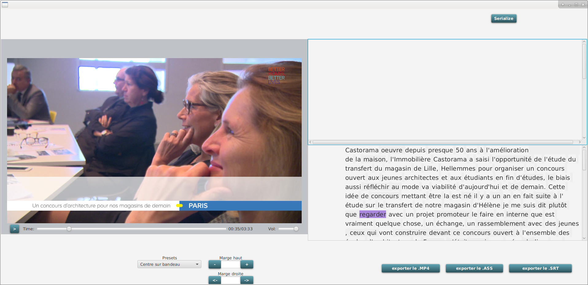
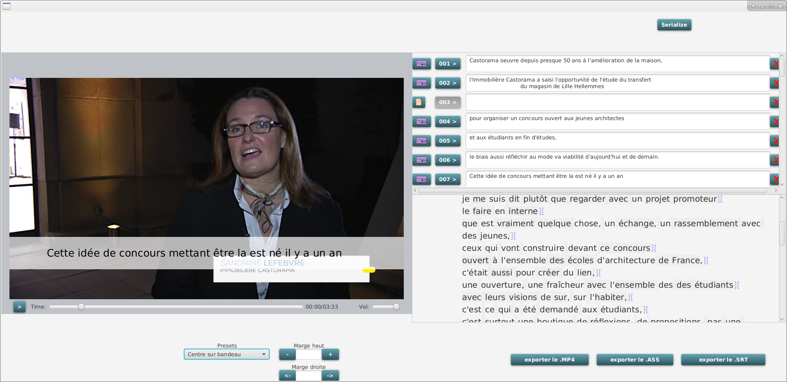
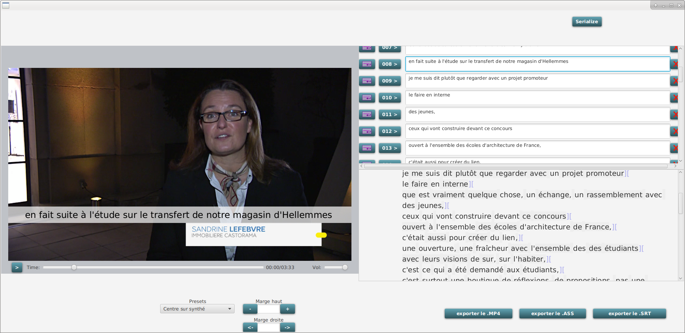

# SousTitres_maker
*Générer les sous-titres, leur prévisualisation puis le film sous-titré à partir d'un fichier XML (timecodes des mots) sans faire appel à un éditeur NLE (javaFX + mongoDB)*

####Fenetre principale à l'ouverture du projet (vidéo et fichier XML hard-coded)####
le mot en cours de lecture dans l'audio du player apparait surligné. 

####sélection du point de sésure dans le texte####
la césure entre les mots apparait au déplacement de la souris sur la boite du texte.

####validation du point de sésure####
un clic sur le point de césure le valide. Il est marqué par un double crochet et peut etre effacé.
Une boite avec le texte est créée.

####preview du sous-titre####
Si on déplace le curseur du lecteur dans la zone de ce texte, le mot en cours de lecture est toujours affiché dans la boite de texte, mais on voit aussi le sous-titre correspondant s'afficher sur la vidéo.

####exemple avec plusieurs textes, toujours présentés sur une ligne####
la présentation par défaut à chaque sélection d'une césure, est sur une ligne.

####présentation sur deux lignes####
Dans la boite des sous-titres, le bouton à gauche du texte (retour chariot violet) permet de le lier à la boite située au dessus.
Le bouton en forme de feuille qui apparait alors permet de rétablir le texte sur une ligne.

####correction du texte####
Les correcttions apportées dans ls boites des sous-titres sont immédiatement répercutées dans les sous-titres affichés sur la vidéo.

####presets####
Il est possible de définir des modes de placement du texte et des bandeaux de tailles et de position différents.
En choisissant le preset dans la liste, on mets rapidement en forme ses sous-titres.

#### nouvelle correction du texte####

